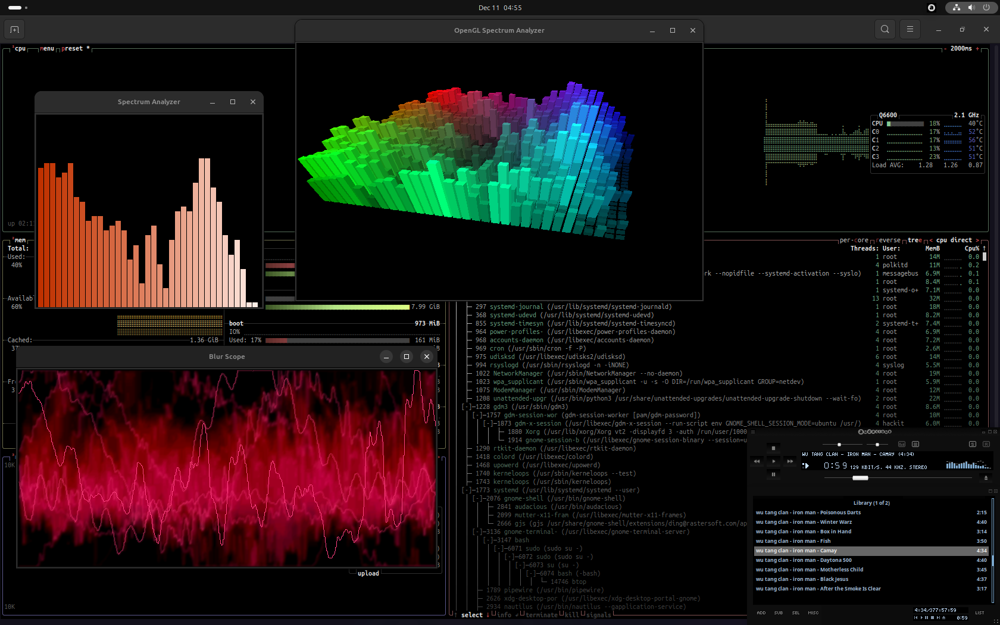

# Damn it works fucking nice 

### Ubuntu 24.04.1!



## problem detector ALERT() alarma() ACHTUNG() FREEZZZZZZZE() :D

I was surprised to find apt repositories on http without the **s** :D

wayland is having the same effect when you watch a movie ~10 years ago... it's flickering in the desktop UI without video playing...

gtk seem unable to grab gl pointer... gnome-terminal is having hard moment to render it's surface :D

dnssec, TLS  :) :) :) 

```
WaylandEnable=false
```

on X everything works... I can have 3 GL window opened at same time! doesn't flicker...

## first update... everything went crazy nasty...

- had my home in the desktop dir... did use symlinks to a device so I don't need to move stuffs...
```
Desktop => to somewhere
Documents => ""
Music => ""
```
after a reboot the user home dir was into desktop alike desktop was /home.

- GDM is sensibly broken... must avoid login... it's **still** not a mastered technology... :D

after update and removing a little from what I dont need... GDM is having a sad grey unresponsive interface...
```
automaticlogin=YEEYES :D
```

## Assumptions

esthetically it's beautifuly engineered. The only thing disturbing me is the frame size(when there is nothing interesting to be placed in)...

## Feels

Fucking nice, everything working smooth... I'm having erections.

###### 752963e64
