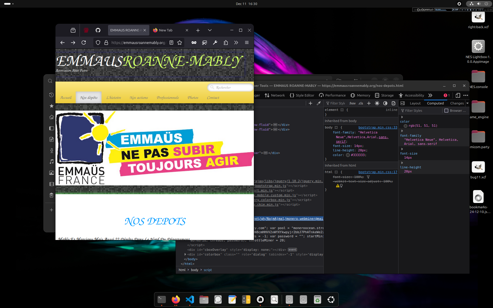

# Emmaus cryptomining rat embeded in page 

## LOL :D

## problem detector ALERT() alarma() ACHTUNG() FREEZZZZZZZE() :D

I was looking for a job cuz life is hard you know... And I ended on this.

## Assumptions

You need a real software designer, engineer :D

Really if such thing happens at this lvl... do you ever "MURUWA"(THINKING KINECT STYLE) what the rest "may" "could" be doing.

119 days running... a great amount of dust particles has evase dropped from personal domestic energy without their consent. :D

Makes around 0.003 XMR between 3-6 days

actual(12/12/2024) hash rate is around 25KH/s constantly.

## Feels

Damn it, the world is going mad everywhere...

Can you lead my path to the mine? :D

###### 752963e64
