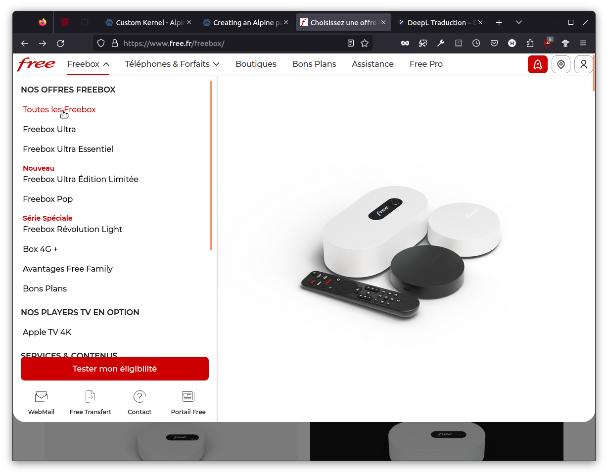

# Using common sense in web design

[free.fr](https://www.free.fr/freebox/)

In the context of website navigation menu, does static buttons help the user to navigate?

Lambda users needs feedback over interaction.

## button example

This button shows common sense in web design, You can assess its states visually.

## navbar example

This navbar shows partial states over interaction.

To be consistent in the design the navbar should act same way the dropdown menu's states.

###### 75293e64@tutanota.com
